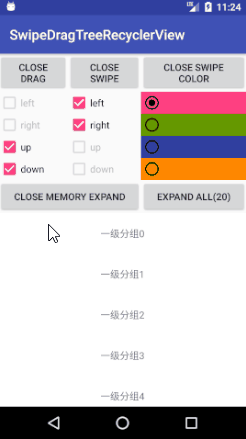

# SwipeDragTreeRecyclerView 使用说明

[GitHup 主页](https://github.com/goweii/SwipeDragTreeRecyclerView)

##  **功能**
 - **树形结构 RecyclerView**
 - **支持滑动删除**
 - **支持长按拖拽**
 - **支持单个 view 点击或长按时拖拽**
 - **可开启并更改滑动删除背景色**
 - **可自由指定滑动删除和拖拽操作的方向**
 - **展开关闭全部分组**

## **下载**

 - Demo：[下载](https://github.com/goweii/SwipeDragTreeRecyclerView/blob/master/app/debug/SwipeDragTreeRecyclerView_debug_v1.0.0.apk)

## **截图**


## **使用方法**
[](https://jitpack.io/#goweii/SwipeDragTreeRecyclerView)

 - ### 添加jitpack库

``` stylus
	allprojects {
		repositories {
			...
			maven { url 'https://jitpack.io' }
		}
	}
```

 - ### 添加依赖

``` stylus
	dependencies {
	        compile 'com.github.goweii:SwipeDragTreeRecyclerView:v1.0.0'
	}
```

 - ### 在xml布局文件中使用官方RecyclerView

``` stylus
<android.support.v7.widget.RecyclerView
	android:id="@+id/swipe_drag_tree_recyclerView"
	android:layout_width="match_parent"
	android:layout_height="match_parent" >
</android.support.v7.widget.RecyclerView>
```
 - ### 继承 TreeState 增加几个静态变量，用于标识 item 的类别
	当然，你的数据应该存放在 TreeState 中

``` stylus
public class TestTreeState extends TreeState {
    public static final int TYPE_ONE = 1;
    public static final int TYPE_TEO = 2;
    public static final int TYPE_THREE = 3;
    public static final int TYPE_FOUR = 4;
}
```

 - ### 用你的 adapter 继承 BaseSwipeDragTreeAdapter 实现几个方法
	 - **initIds()**
		在这个方法中你应该调用下面2个方法完成相关初始化
		 - **putTypeLayoutViewIds(int viewType, int layoutId, int[] viewIds, int[] clickFlags)**
			这4个参数的含义为：
			 - viewType
                类别 继承 TreeState 增加的静态变量
			 - layoutId
			    布局id
			 - viewIds
			    布局中需要用到的 view 的 id
			 - clickFlags
			    设置 view 是否需要点击事件，设置为 null 时默认不开启长按和单击， ClickFlag 为 adapter 的静态内部类，你直接使用即可
		 - **putTypeStartDragViewIds(int viewType, @IdRes int[] viewIds, int[] startDragFlags)**
			 如果你想让某一个 view 在点击或者长按时实现拖拽，而不是在长按整个 item 时，应该调用这个方法完成配置
			  - viewType
			    布局类型
			  - viewIds
			    拖拽操作的 view 的 id
			  - startDragFlags
			    拖拽标志，StartDragFlag 为 adapter 的静态内部类，你直接使用即可

	 - **bindData(BaseViewHolder holder, TypeData data)**
		你应该调用 holder.getItemViewType() 方法得到自定义的 item 的类别，依据类别判断 holder 绑定的数据类型，然后调用 holder 的 getView 方法获取 view 实例进行数据绑定

``` stylus
public class TestBaseSwipeDragTreeAdapter extends BaseSwipeDragTreeAdapter {
    private final int mOrientationType;

    public TestBaseSwipeDragTreeAdapter(int orientationType) {
        super();
        mOrientationType = orientationType;
    }

    @Override
    public void initIds() {
        putTypeLayoutViewIds(TestTreeState.TYPE_ONE, R.layout.item1_swipe_drag_tree_recycler_view,
                new int[]{R.id.item1_sdtrv_tv}, null);
        putTypeLayoutViewIds(TestTreeState.TYPE_TEO, R.layout.item2_swipe_drag_tree_recycler_view,
                new int[]{R.id.item2_sdtrv_tv}, null);
        putTypeLayoutViewIds(TestTreeState.TYPE_THREE, R.layout.item3_swipe_drag_tree_recycler_view,
                new int[]{R.id.item3_sdtrv_tv}, null);
        putTypeLayoutViewIds(TestTreeState.TYPE_FOUR, R.layout.item4_swipe_drag_tree_recycler_view,
                new int[]{R.id.item4_sdtrv_tv}, null);
        putTypeLayoutViewIds(TestTreeState.TYPE_LEAF, R.layout.item5_swipe_drag_tree_recycler_view,
                new int[]{R.id.item5_sdtrv_tv}, null);
        putTypeStartDragViewIds(TestTreeState.TYPE_ONE,
                new int[]{R.id.item1_sdtrv_tv}, null);
        putTypeStartDragViewIds(TestTreeState.TYPE_TEO,
                new int[]{R.id.item2_sdtrv_tv}, null);
        putTypeStartDragViewIds(TestTreeState.TYPE_THREE,
                new int[]{R.id.item3_sdtrv_tv}, null);
        putTypeStartDragViewIds(TestTreeState.TYPE_FOUR,
                new int[]{R.id.item4_sdtrv_tv}, null);
        putTypeStartDragViewIds(TestTreeState.TYPE_LEAF,
                new int[]{R.id.item5_sdtrv_tv}, null);
    }

    @Override
    protected void bindData(BaseViewHolder holder, TypeData data) {
        SwipeDragTreeViewHolder viewHolder = (SwipeDragTreeViewHolder) holder;
        switch (holder.getItemViewType()) {
            case TestTreeState.TYPE_ONE:
                TextView textView0 = (TextView) viewHolder.getView(R.id.item1_sdtrv_tv);
                textView0.setText((String) data.getData());
                break;
            case TestTreeState.TYPE_TEO:
                TextView textView1 = (TextView) viewHolder.getView(R.id.item2_sdtrv_tv);
                textView1.setText((String) data.getData());
                break;
            case TestTreeState.TYPE_THREE:
                TextView textView2 = (TextView) viewHolder.getView(R.id.item3_sdtrv_tv);
                textView2.setText((String) data.getData());
                break;
            case TestTreeState.TYPE_FOUR:
                TextView textView3 = (TextView) viewHolder.getView(R.id.item4_sdtrv_tv);
                textView3.setText((String) data.getData());
                break;
            case TestTreeState.TYPE_LEAF:
                TextView textView4 = (TextView) viewHolder.getView(R.id.item5_sdtrv_tv);
                textView4.setText((String) data.getData());
                break;
            default:
                break;
        }
    }
}
```
 - ### 在你的 activity 中调用 init() 方法为适配器绑定数据

``` stylus
        mSwipeDragTreeRecyclerView.setLayoutManager(getLayoutManager());
        mSwipeDragTreeRecyclerView.setAdapter(mTestBaseSwipeDragTreeAdapter);
        mTestBaseSwipeDragTreeAdapter.init(mDatas);
```

## Adapter 相关方法说明
 - ### **init(ArrayList datas)**
	给适配器绑定数据
 - ### **isMemoryExpandState()**
	获取分组关闭后是否记忆子分组的展开状态
 - ### **setMemoryExpandState(boolean memoryExpandState)**
	设置分组关闭后是否记忆子分组的展开状态
 - ### **isAllExpand()**
	获取是否已经展开所有分组
 - ### **expandAll()**
	展开所有分组
 - ### **unExpandAll()**
	关闭所有分组
 - ### **getPositions(int position)**
	获取该 holder 位置所显示数据在树形结构数据中所处的位置
 - ### **setOnExpandChangeListener(OnExpandChangeListener onExpandChangeListener)**
	设置 item 展开状态改变监听器
 - ### **notifyItemSwipe(int position)**
	更新数据滑动删除，在监听器中调用更新数据
 - ### **notifyItemDrag(int currentPosition, int targetPosition)**
	更新数据拖拽移动，在监听器中调用更新数据
 - ### **setOnItemSwipeListener(SwipeDragCallback.OnItemSwipeListener onItemSwipeListener)**
	设置滑动删除监听器，应该调用 notifyItemSwipe 方法更新数据显示
 - ### **setOnItemDragListener(SwipeDragCallback.OnItemDragListener onItemDragListener)**
	设置 item 拖拽监听器，应该调用 notifyItemDrag 方法更新数据显示
 - ### **setItemViewSwipeEnabled(boolean itemViewSwipeEnabled)**
	设置开启关闭滑动删除
 - ### **setLongPressDragEnabled(boolean longPressDragEnabled)**
	设置开启关闭长按拖拽
 - ### **setSwipeBackgroundColorEnabled(boolean swipeBackgroundColorEnabled)**
	设置开启关闭滑动删除背景色
 - ### **isItemViewSwipeEnabled()**
	获取是否开启滑动删除
 - ### **isLongPressDragEnabled()**
	获取是否开启长按拖拽
 - ### **isSwipeBackgroundColorEnabled()**
	获取是否开启滑动删除背景色
 - ### **setSwipeBackgroundColor(@ColorInt int swipeBackgroundColor)**
	设置滑动删除背景色颜色
 - ### **setCustomSwipeFlag(int customSwipeFlag)**
	设置可以滑动删除的方向，默认为垂直于滚动方向的2个方向
 - ### **setCustomDragFlag(int customDragFlag)**
	设置可以拖拽的方向，线性布局默认为平行于滚动方向的2个方向，网格和流布局默认为上下左右4个方向都可以
 - ### **setOnItemViewClickListener(OnItemViewClickListener onItemViewClickListener)**
	设置 itemView 点击监听器
 - ### **setOnItemViewLongClickListener(OnItemViewLongClickListener onItemViewLongClickListener)**
	设置 itemView 长按监听器
 - ### **setOnCustomViewClickListener(OnCustomViewClickListener onCustomViewClickListener)**
	设置 item 子 view 点击监听器，需要在适配器的 initIds() 方法中开启
 - ### **setOnCustomViewLongClickListener(OnCustomViewLongClickListener onCustomViewLongClickListener)**
	设置 item 子 view 长按监听器，需要在适配器的 initIds() 方法中开启

## 注意

 - 发现 bug 请联系 QQ302833254

